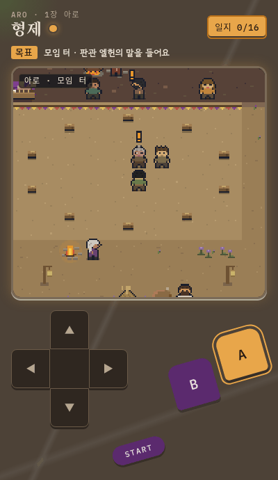
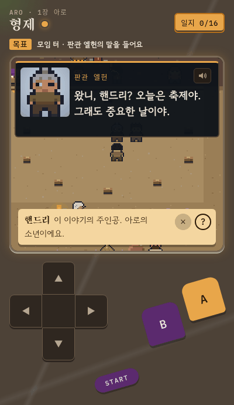
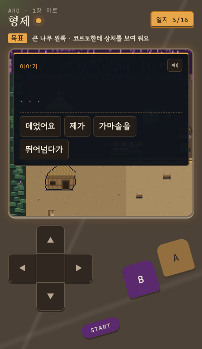
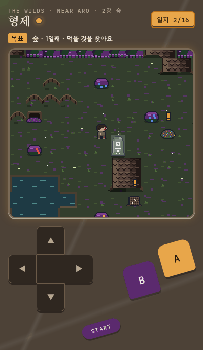
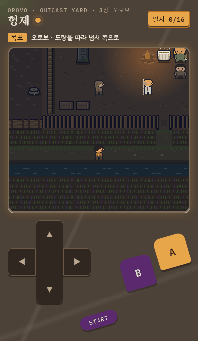
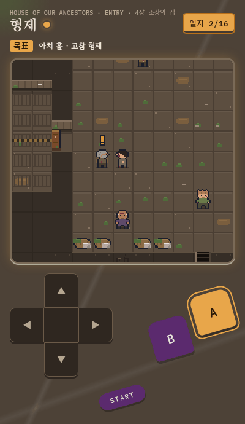

# 형제

A pixel-art walk-around Korean vocabulary game following Handry's exile in Adrian Tchaikovsky's novella *The Expert System's Brother*.
Sister game of [성실호](https://github.com/Stan-Stani/seongsilho) — same engine, and it never re-teaches 성실호's words.

**Play:** https://stan-stani.github.io/hyeongje/ (built for phones; arrow keys + Z/X on a keyboard)

| | | |
|:-:|:-:|:-:|
|  |  |  |
| 1장 · 아로 | Tap any word: Korean first, English behind ? | Word-order puzzles |
|  |  |  |
| 2장 · the wilds | 3장 · 드로보 | 4장 · the ancestors' house |

- Four chapters, each with its own save; spaced review at the memory stones
- Tap any Korean word for a simple Korean definition; English is behind the **?** button
- Runs on the shared [walk engine](https://github.com/Stan-Stani/walk-engine) with 성실호, 방과 후 and 단어 마을

A fan-made learning tool. It contains no text from the novella, and the book itself is not included.

## Build and test
`python3 build.py` assembles `index.html` from `src/`; `node tests/validate.mjs`; `node tests/play.mjs ch1`.
